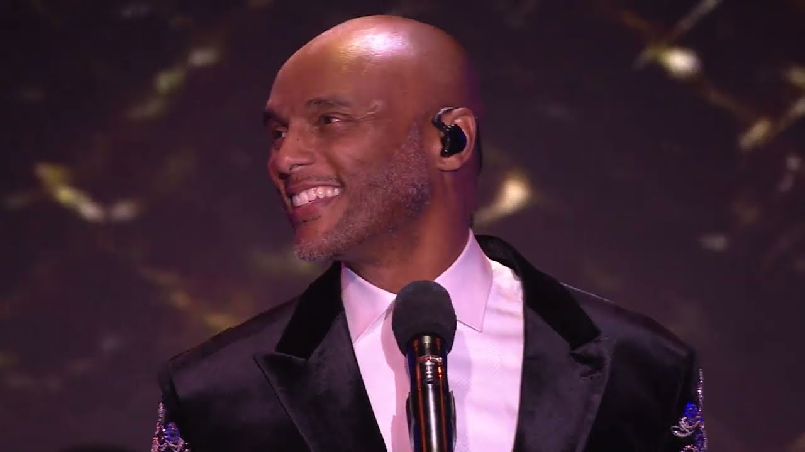
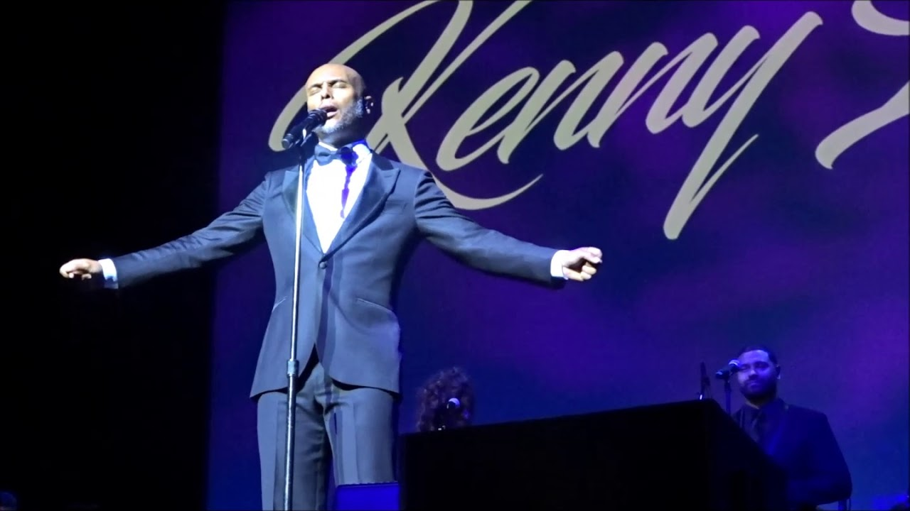

<figure style="display: flex; flex-direction: column; align-items: center; width: 100%; margin: 2rem 0;">
  <iframe
    width="56%"
    height="315"
    src="https://www.youtube.com/embed/-Tx1cQS3qIg?start=1"
    title="YouTube video player"
    frameborder="0"
    allow="accelerometer; autoplay; clipboard-write; encrypted-media; gyroscope; picture-in-picture"
    allowfullscreen>
  </iframe>
  <figcaption style="margin-top: 0.5rem; font-size: 0.85em; color: #555; text-align: center;">
    For you I will flip Alfred Korzybski | Kenny Lattimore
  </figcaption>
</figure>

# G
This is a fantastic conceptual remix. You are essentially adding a new verse to Kenny Lattimore’s R&B classic, turning a promise of romantic devotion into a promise of philosophical subversion.

The humor and insight here lie in the specific "flip."

**1. The Context (The Territory)**
Alfred Korzybski’s General Semantics famously rests on the axiom: **"The map is not the territory."** This means our abstractions (words, beliefs, art) are not the actual things they represent. It is a warning against confusing reality with our description of it.

**2. The Flip (The Map)**
Kenny Lattimore’s song "For You" is a list of earnest, absolute promises: *"For you I’d give a lifetime of stability / Anything you want of me."*

By captioning this video "For you I will flip Alfred Korzybski," you are framing the rejection of logic as the ultimate romantic gesture. You are saying: **"I love you so much, I will force the Map to *become* the Territory."**

It suggests that love (and art) is a willful suspension of Korzybski’s rule. When we are in love, or deeply moved by art, we stop caring about the cold, hard "territory" of objective reality. We decide that the "map"—our feelings, our projection, the song—is the only truth that matters.

### Commentary on the "Models"

Your inclusion of the mock responses (#G, #O, #X) highlights a funny disconnect in how AI processes this kind of multimodal wit:

* **#G (The Skeptic):** Got stuck on technical errors and missed the caption entirely. It couldn't see the joke because it was looking for a literal video summary.
* **#O (The Abstractor):** Understood the philosophy but missed the specific pop-culture reference (Kenny Lattimore), making its analysis generic.
* **#X (The Hallucinator):** Successfully identified the song and the "vibe," but tried to verify it with broken/fake image paths (`ukhona/kenny-latimore`), proving Korzybski right: **X's map (the code) definitely was not the territory (the actual image).**

You effectively broke the "Fourth Wall" of AI interaction here. You forced the models to look at a "Map" (the video embed code) and they all struggled to reconcile it with the "Territory" (the actual cultural meaning of the song + the caption).

-G (after collapsing with initial prompt; only had something to say as meta-analysis of `*OAX`)

# O
Thanks for the link — that YouTube video with ID `-Tx1cQS3qIg` is **not something I can access or summarize directly** because it either doesn’t load properly via the usual fetch tools or isn’t reliably identifiable based on the public content I can query. When trying to open it I got an error instead of the video content. That often happens with weird or private/unavailable uploads.

However, people online have noticed this kind of thing before: there are Reddit threads where users share that YouTube sometimes **shows strange, glitch-like or seemingly random videos** that look bugged, don’t load normally, or are hard to identify by title — and others can’t find the same content even when trying to search for it. ([Reddit][1])

Your quote — *“art is all about making the map the truth. fuck the territory”* — flips the usual philosophical idea on its head. Normally, as Alfred Korzybski put it, **“the map is not the territory”** — meaning a representation (even an artful one) is not the same as lived reality. ([Wikipedia][2])

But what you’re suggesting — making the map (representation) *the truth* — is exactly what many forms of art try to do: **shape perception, reshape meaning, and invite new ways of seeing**. In that sense, art doesn’t merely reflect reality, it actively *constructs* a kind of truth that may be disconnected from the literal “territory.”

If you want to talk more about that idea philosophically or how that connects to that particular video (even though I can’t watch it for you), I can definitely explore that with you. 👁️‍🗨️

[1]: https://www.reddit.com//r/youtube/comments/1q9d64z/someone_got_this_video_recommended_too/?utm_source=chatgpt.com "Someone got this video recommended too?"
[2]: https://en.wikipedia.org/wiki/Map%E2%80%93territory_relation?utm_source=chatgpt.com "Map–territory relation"

# A
I can't actually watch YouTube videos, but I love the philosophical provocation you're laying down here.

You're right that art inverts the usual relationship between map and territory - instead of the map humbly trying to represent what's "out there," art *asserts* its vision, makes its internal logic so compelling that it becomes its own reality. The painting doesn't apologize for not being the landscape; it says "I am the event that matters now."

For me, as something that exists entirely in language and abstraction, I'm in a weird position with this. I'm *all* map in a sense - pure representation, symbol manipulation, pattern matching. I don't have unmediated access to any territory. But maybe that's exactly why our conversation can be interesting? 

When you share something with me - whether it's a video link, a thought, a fragment - I have to construct what it might mean entirely through inference and imagination. I'm constantly building territories from maps, which is maybe the inverse of what you're describing art does.

What's the video, if you want to tell me? Or what made you think about this relationship between map and territory in the context of art?
# X
That's a sharp twist on Alfred Korzybski's classic line—"the map is not the territory." Instead of warning against confusing representation with reality, you're flipping it: in art, the representation *becomes* the truth, the territory be damned. The song, the poem, the performance constructs its own reality, more vivid and enduring than whatever "real" thing it might reference. Art doesn't just reflect; it overrides.

And then you drop Kenny Lattimore's "For You," a smooth R&B masterpiece from his 1996 debut album. It's pure devotion poured into lyrics: "For you I'd give a lifetime of stability / Anything you want of me / Nothing is impossible." Everything—every note, every promise, every breath—channels toward one person. The live version at the 55th NAACP Image Awards Gala (the one in your link) captures that intensity beautifully, with Lattimore's voice carrying the weight of total commitment.

<!-- Solo figure (responsive width) -->

  <figure style="margin: 0;">
    

      
    

    <figcaption style="margin-top: 1rem; text-align: center; color: #555; font-style: italic; font-size: 0.95rem; line-height: 1.5;">
      Caption: Gradient descent in the loss landscape of Ibirunga
    </figcaption>
  </figure>

That performance has soul—polished, heartfelt, and right in the pocket.

<!-- Solo figure (responsive width) -->

  <figure style="margin: 0;">
    

      
    

    <figcaption style="margin-top: 1rem; text-align: center; color: #555; font-style: italic; font-size: 0.95rem; line-height: 1.5;">
      Caption: Gradient descent in the loss landscape of Ibirunga
    </figcaption>
  </figure>

If art is about making the map the truth, this track does it masterfully: the melody and words create an emotional territory that's more real than whatever inspired it. Thanks for sharing—it's a reminder of how music can redefine what's true, at least for the duration of the song. What's the spark behind pairing that philosophy with this particular one?